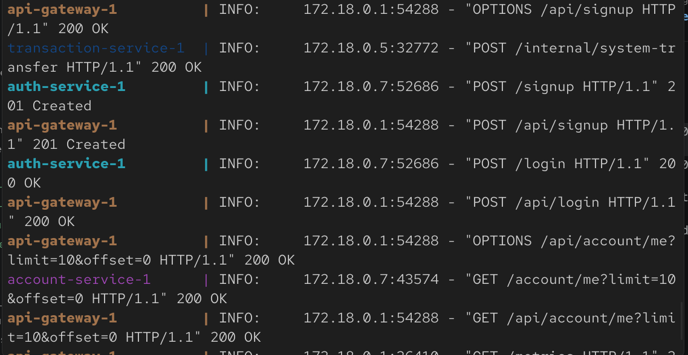
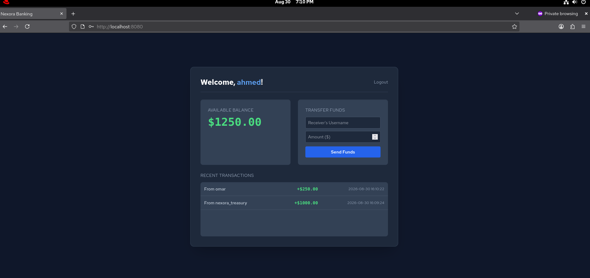
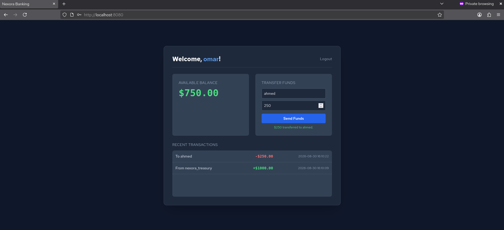
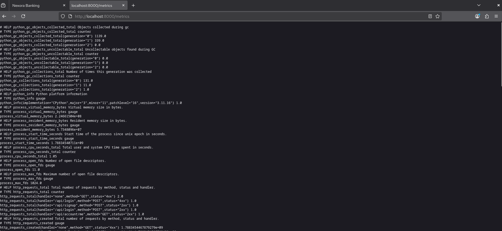

# Nexora Core Banking Platform: Workload Architecture & Engineering Reference

An institutional-grade, distributed core banking application workload designed for the **Nexora Enterprise GitOps Platform**. This project demonstrates a Zero-Trust microservices architecture with edge token verification, a Two-Phase Lease idempotency engine with monotonic **Fencing Tokens**, double-entry bookkeeping, automated concurrency test suites, and ACID-compliant distributed locking.

---

## Table of Contents

1. [Overview](#overview)
2. [Quick Start](#quick-start)
3. [Architecture](#architecture)
4. [Prerequisites](#prerequisites)
5. [Local Development with Docker Compose](#local-development-with-docker-compose)
6. [Microservice Domain & Service Specifications](#microservice-domain--service-specifications)
7. [Financial Concurrency & Fencing-Token Engine](#financial-concurrency--fencing-token-engine)
8. [Failure Decision & Idempotency State Matrix](#failure-decision--idempotency-state-matrix)
9. [Secrets & Configuration Management](#secrets--configuration-management)
10. [Container Optimization & Multi-Stage Builds](#container-optimization--multi-stage-builds)
11. [Metrics & Observability Instrumentation](#metrics--observability-instrumentation)
12. [Automated Concurrency Testing & System Verification](#automated-concurrency-testing--system-verification)
13. [Real-World Troubleshooting & Solutions](#real-world-troubleshooting--solutions)
14. [Screenshots Index](#screenshots-index)

---

## Overview

The Nexora banking workload is structured as a polyglot, domain-driven microservice system designed to rigorously validate cloud-native platform infrastructure (Kubernetes Ingress, Cilium Network Policies, Istio mTLS, External Secrets Operator, AWS RDS, and Prometheus/HPA autoscaling).

| Service | Technology | Responsibility | Port |
|---|---|---|---|
| `frontend-web` | NGINX 1.25 / Alpine / Vanilla JS / Tailwind | Client Single-Page App (SPA), Tab-isolated Session Manager | 8080 (Mapped: 80) |
| `api-gateway` | Python 3.11 / FastAPI / Asynchronous `httpx` | Edge Rate-Limiting, Distributed Tracing (`X-Correlation-ID`), JWT Verification | 8000 |
| `auth-service` | Python 3.11 / FastAPI / `bcrypt` / `PyJWT` | Identity Management, Password Hashing, Deterministic Grant Delegation | 8000 (Internal) |
| `account-service` | Python 3.11 / FastAPI / `DBUtils` / `PyMySQL` | Strictly Read-Only CQRS Ledger, Paginated Account Queries | 8000 (Internal) |
| `transaction-service` | Python 3.11 / FastAPI / `Decimal` / `httpx` | Sole Mutation Authority, Deterministic Locks, Fencing-Token Lease Engine | 8000 (Internal) |
| `fraud-service` | Python 3.11 / FastAPI / `prometheus-fastapi` | CPU-Intensive Risk Engine, HPA & Prometheus Golden Signals Target | 8000 (Internal) |
| `mysql-db` / AWS RDS | MySQL 8.0 (InnoDB) | Relational ACID Persistence, Row-Level Locking, Composite Unique Constraints | 3306 |

---

## Quick Start

```bash
git clone https://github.com/nexora-platform/nexora-apps.git
cd nexora-apps
```

**1. Spin up the complete stack locally**
```bash
docker compose down -v
docker compose build --no-cache
docker compose up
```

**2. Access the Application Dashboard**
Open your browser to:
```text
http://localhost:8080
```

**3. Test Peer-to-Peer Transfers**
* Open **Tab 1**: Register as `ahmed` (password: `password123`). Log in -> Balance will display **$1,000.00** from the Treasury Reserve.
* Open **Tab 2**: Register as `omar` (password: `password123`). Log in -> Balance will display **$1,000.00**.
* In **Tab 1**, transfer `$250.00` to `omar`.
* In **Tab 2**, observe omar's balance update to **$1,250.00** and Ahmed's balance update to **$750.00**.

```text

Note: Giving each user $1000 on signup is designed for testing purporses and not a real scenario.

```
---

## Architecture

### System Topology

```text
                                  [ CLIENT BROWSER / SPA ]
                                             │
                     ┌───────────────────────┴───────────────────────┐
                     │ (Port 8080 / Static Assets)                   │ (Port 8000 / Dynamic API)
                     ▼                                               ▼
         [ frontend-web (Nginx) ]                        [ api-gateway (FastAPI) ]
         • SPA Dashboard (Tailwind CSS)                  • Perimeter Rate Limiting (Sliding Window)
         • Client-Side UUID Idempotency-Keys             • Distributed Tracing (X-Correlation-ID)
         • Tab-Isolated Session Storage                  • Edge JWT Verification & Claim Stripping
                                                         • Spec-Valid CORS (Explicit Origins)
                                                         • Transparent CORS OPTIONS Bypass
                                                         • Trusted Downstream Header Injection (X-User-Id)
                                                                     │
                       ┌─────────────────────────────────────────────┼─────────────────────────────────────────────┐
                       │                                             │                                             │
                       ▼ (Public Routing)                            ▼ (Protected Routing)                         ▼ (Protected Routing)
             [ auth-service ]                              [ account-service ]                           [ transaction-service ]
             • Salting & Bcrypt Hashing                    • Strictly Read-Only CQRS Ledger              • 1. Phase 1: Fast Lease (<1ms)
             • 15-min JWT Minting (HS256)                  • Paginated Queries (Limit/Offset)            • 2. Phase 2: Unconnected Fraud RPC
             • Deterministic Grant RPC Delegation          • Zero Side Effects on GET /account/me        • 3. Phase 3: Fast Mutation (<5ms)
             • Lazy Connection Pooling                     • Lazy Connection Pooling                     • 4. Monotonic Fencing Tokens
             • Lifespan Graceful Draining                  • Lifespan Graceful Draining                  • 5. Sole Ledger Mutation Authority
                       │                                             │                                             │
                       │ (Pooled DB Connections)                     │ (Pooled DB Connections)                     │ (Pooled DB Connections)
                       └─────────────────────────────────────────────┼─────────────────────────────────────────────┘
                                                                     │                                             │ (Synchronous HTTP / 2s Timeout)
                                                                     ▼                                             ▼
                                                        [ MySQL 8.0 / AWS RDS ]                           [ fraud-service ]
                                                        • InnoDB Engine (ACID)                            • CPU-Intensive Math Loops
                                                        • Row-Level Locking (FOR UPDATE)                  • Prometheus Metrics Target
                                                        • Composite Constraints (user_id, key)            • HPA Autoscaling Target
```

---

## Prerequisites

* Docker Engine (>= 24.0) & Docker Compose V2
* Python 3.11+ (for local test runner execution)
* `pytest`, `pytest-asyncio`, and `httpx` (for running the automated concurrency test suite)
* Modern Web Browser (Chrome, Firefox, Brave, Edge)

---

## Local Development with Docker Compose

Local development runs the entire 7-tier microservice architecture connected over an internal Docker bridge network (`nexora_default`). Internal backend services (`auth-service`, `account-service`, `transaction-service`, `fraud-service`) use `expose` rather than `ports`, preventing direct host access and mimicking a private Kubernetes subnet.

```bash
docker compose up --build
```


### Endpoints
* **Frontend Portal:** `http://localhost:8080`
* **API Gateway Health:** `http://localhost:8000/health/liveness`
* **Prometheus Metrics (Gateway):** `http://localhost:8000/metrics`
* **MySQL Database:** `localhost:3306` (`user: dbuser`, `password: dbpassword`, `database: nexora_bank`)

---

## Microservice Domain & Service Specifications

### 1. `frontend-web`
* **Session Management:** Stores short-lived access tokens in `sessionStorage` rather than `localStorage`, enabling isolated multi-tab concurrent user simulation.
* **Idempotency Generation:** Automatically generates a client-side UUID (`crypto.randomUUID()`) attached as an `Idempotency-Key` header on every financial mutation.

### 2. `api-gateway`
* **Perimeter Rate Limiting:** Enforces in-memory sliding-window throttles (`/login`: max 5 req/min per IP; `/signup`: max 3 req/hr per IP).
* **Distributed Tracing:** Inspects incoming traffic for `X-Correlation-ID`. If missing, mints a UUID and propagates it across downstream HTTP headers and client responses.
* **Edge Authentication:** Verifies JWT signatures (`HS256`, 15-minute expiration), drops untrusted client headers, and injects verified `X-User-Id` and `X-Username` headers downstream.
* **CORS Specification:** Strictly enforces explicit allowed origins (`CORS_ORIGINS`) with `allow_credentials=True` and provides an unauthenticated bypass for HTTP `OPTIONS` preflight checks.

### 3. `auth-service`
* **Password Hashing:** 12-round salted hashing using the official C-optimized `bcrypt` library.
* **Atomic Identity Provisioning:** Creates user credentials and opens an account with `$0.00` in a single SQL transaction.
* **Deterministic Grant Delegation:** Delegates the $1,000.00 welcome grant to `transaction-service` using a deterministic key (`grant-user-{id}`). In case of network timeouts, local state is preserved without destructive rollbacks, making the grant safely retryable.

### 4. `account-service`
* **Strictly Read-Only (Zero Side Effects):** Operates purely as a CQRS read model. Never creates money or alters balances on `GET /account/me`. Raises `404 Not Found` if an account is unprovisioned.
* **Paginated Queries:** Implements `limit` (max 50) and `offset` SQL parameters for transaction history.

### 5. `transaction-service`
* **Sole Mutation Authority:** The single service in the entire platform permitted to alter account balances. Exposes `/transfer` (customer peer-to-peer) and `/internal/system-transfer` (constant-time verified system grants via `secrets.compare_digest`).
* **Deterministic Lock Ordering:** Sorts sender and receiver IDs (`min(sender, receiver)` -> `max(sender, receiver)`) before acquiring `SELECT ... FOR UPDATE` row locks, mathematically preventing deadlocks.
* **Exact Decimal Math:** Python `Decimal` + SQL `DECIMAL(15,2)` strictly enforced.

### 6. `fraud-service`
* **Risk Engine Simulation:** Heavy mathematical loops simulating CPU-intensive algorithmic scoring.
* **Observability:** Exposes latency, saturation, error rate, and request volume via `prometheus-fastapi-instrumentator` on `/metrics`.






---

## Financial Concurrency & Fencing-Token Engine

Holding open database connections across external network I/O boundaries causes connection pool exhaustion under load. Nexora solves this via a **Two-Phase Lease Pattern with Monotonic Fencing Tokens (Kleppmann Pattern)**.

```text
[ Phase 1: Atomic Lease Claim & Fencing Token Minting (<1ms) ]
  ├── Check out DB connection
  ├── INSERT INTO idempotency_records (user_id, idempotency_key, 'PROCESSING', lease_version = 1)
  ├── COMMIT & RELEASE connection back to pool immediately!
  └── (If duplicate & status == 'PROCESSING' for >10s, execute Atomic CAS Reclaim with lease_version = lease_version + 1!)

[ Phase 2: External Risk Gating (Zero DB Connections Held) ]
  ├── Zero DB connections pinned during the 2.0s window
  └── Execute synchronous HTTP call to fraud-service (2.0s timeout)

[ Phase 3: Financial Execution & Fencing Commit Gate (<5ms) ]
  ├── Check out fresh DB connection
  ├── BEGIN TRANSACTION
  ├── Ascending Row Locks: SELECT ... FOR UPDATE (min_id, max_id)
  ├── Balance checks & Decimal mutations
  ├── INSERT INTO transactions audit record
  ├── UPDATE idempotency_records SET status = 'COMPLETED' WHERE lease_version = acquired_version
  │     ├── rowcount == 1 -> COMMIT & RELEASE connection
  │     └── rowcount == 0 -> ROLLBACK! (Zombie worker detected: lease was reclaimed during Phase 2)
```

### The Zombie Worker Protection (Fencing Token Query)
If a worker suffers an asynchronous pause (e.g., GC stall or network delay) during Phase 2, a concurrent retry reclaims the lease by incrementing `lease_version`. When the stalled worker wakes up, its Phase 3 commit is rejected at the database engine level:

```sql
UPDATE idempotency_records 
SET status = 'COMPLETED', response_body = ?
WHERE user_id = ? AND idempotency_key = ? AND lease_version = ?;
```
* `rowcount == 1`: The worker still holds the active lease; transaction commits safely.
* `rowcount == 0`: Fencing token mismatch. The worker rolls back immediately without mutating balances, eliminating split-brain double-spending.

---

## Failure Decision & Idempotency State Matrix

| Event / Outcome | Classification | Phase | DB Connection Held During Error? | Idempotency Record State | Client Response on Retry |
| :--- | :--- | :--- | :--- | :--- | :--- |
| **Transfer Success** | Successful Execution | Phase 3 | Yes (<5ms) | `COMPLETED` (success JSON) | Replays cached success message |
| **Insufficient Funds** | Terminal Business Decline | Phase 3 | Yes (<5ms) | `COMPLETED` (decline JSON) | Replays cached "Insufficient funds" |
| **Recipient Not Found** | Terminal Business Decline | Phase 3 | Yes (<5ms) | `COMPLETED` (decline JSON) | Replays cached "User not found" |
| **Fraud Flagged High** | Terminal Risk Decline | Phase 2 | Yes (<1ms write) | `COMPLETED` (decline JSON) | Replays cached "Fraud declined" |
| **Fraud Engine Timeout (2s)** | Transient System Failure | Phase 2 | **NO (0 connections)** | Row deleted (Unconsumed) | Re-executes as a new attempt |
| **Worker Pod Crashes Mid-Flight** | Unhandled Process Death | Phase 2 | **NO (0 connections)** | `PROCESSING` (Stale >10s) | Next retry reclaims lease via CAS + increments `lease_version` |
| **Zombie Worker Awakens** | Split-Brain Race Condition | Phase 3 | Yes (<1ms check) | Unchanged (`COMPLETED`) | Rollback triggered; returns `HTTP 409 Conflict` |

---

## Secrets & Configuration Management

Configuration and secrets are strictly decoupled from application code following 12-Factor principles:

* **Environment Variables:**
  * `DB_HOST`, `DB_USER`, `DB_PASSWORD`, `DB_NAME`: Database target connectivity.
  * `JWT_SECRET`: Secret key for HS256 token minting and perimeter validation.
  * `INTERNAL_SERVICE_SECRET`: Constant-time verified key (`secrets.compare_digest`) for internal RPC calls.
  * `CORS_ORIGINS`: Comma-separated allowed origins (e.g. `http://localhost:8080`).
  * `FRAUD_SVC_URL`, `ACCOUNT_SVC_URL`, `TRANSACTION_SVC_URL`, `AUTH_SVC_URL`: Service discovery endpoints.
* **Kubernetes Integration (Upcoming Phase 3):**
  * `app-secrets` will be dynamically synced from **AWS Secrets Manager** via the **External Secrets Operator (ESO)** and injected at pod runtime.

---

## Container Optimization & Multi-Stage Builds

All Python microservices utilize hardened, multi-stage Docker builds based on Debian `slim`:

```dockerfile
# STAGE 1: Builder (Compiles dependencies in isolated virtualenv)
FROM python:3.11-slim AS builder
WORKDIR /app
RUN python -m venv /opt/venv
ENV PATH="/opt/venv/bin:$PATH"
COPY requirements.txt .
RUN pip install --no-cache-dir -r requirements.txt

# STAGE 2: Runner (Minimal attack surface, unprivileged user)
FROM python:3.11-slim
WORKDIR /app
COPY --from=builder /opt/venv /opt/venv
ENV PATH="/opt/venv/bin:$PATH"
COPY main.py .
RUN addgroup --system appgroup && adduser --system --group appuser
USER appuser
EXPOSE 8000
CMD ["uvicorn", "main:app", "--host", "0.0.0.0", "--port", "8000"]
```

---

## Metrics & Observability Instrumentation

### 1. Prometheus Golden Signals
Every microservice instruments FastAPI via `prometheus-fastapi-instrumentator` exposing standard endpoints at `/metrics`:
* **Latency:** Request duration histograms.
* **Traffic:** Rate of HTTP requests per second partitioned by method, endpoint, and status code.
* **Errors:** HTTP 4xx and 5xx error rates.
* **Saturation:** Thread-pool utilization and connection queue depth.

### 2. Distributed Tracing
The API Gateway generates or propagates an `X-Correlation-ID` header across all downstream RPCs, tying client requests, microservice logs, and database errors into a single unified trace.


---

## Automated Concurrency Testing & System Verification

The repository includes an automated integration test suite in `tests/test_concurrency.py` that executes parallel asynchronous requests against the running cluster to empirically validate concurrency guarantees.

### 1. Running the Automated Concurrency Tests
```bash
pip install pytest pytest-asyncio httpx
pytest tests/test_concurrency.py -v
```

### 2. Test Suite Specifications

```text
tests/test_concurrency.py::test_concurrent_transfers_no_double_spend PASSED   [ 33%]
tests/test_concurrency.py::test_concurrent_idempotency_replays PASSED         [ 66%]
tests/test_concurrency.py::test_bidirectional_transfers_no_deadlock PASSED   [100%]

============================== 3 passed in 1.42s ==============================
```

* **Test 1 (`test_concurrent_transfers_no_double_spend`):** Fires 10 simultaneous $200 transfers from an account with $1,000. Asserts that row-level locking strictly serializes execution to produce exactly 5 successes ($1,000 debited) and 5 rejections for insufficient funds, with ending balance $0.00.
* **Test 2 (`test_concurrent_idempotency_replays`):** Fires 10 simultaneous transfers sharing the exact same `Idempotency-Key` UUID. Asserts that the atomic lease ensures money is debited exactly once ($200) and all requests return 200 or 409.
* **Test 3 (`test_bidirectional_transfers_no_deadlock`):** Fires simultaneous cross-transfers (User A -> User B and User B -> User A). Asserts that deterministic ascending lock ordering (`min/max`) eliminates SQL deadlocks.


*(Note: The fencing token commit gate is verified by database constraint enforcement and code analysis, as black-box HTTP tests cannot easily simulate an asynchronous OS thread pause mid-RPC without synthetic database latency injection).*

---

## Real-World Troubleshooting & Solutions

This section documents the actual technical bugs encountered during the workload engineering process, root-cause diagnoses, and permanent architectural fixes applied.

### 1. MySQL 8.0 `caching_sha2_password` Authentication Crash
* **Symptom:** `pymysql.err.OperationalError: RuntimeError: 'cryptography' package is required for sha256_password or caching_sha2_password auth methods`.
* **Diagnosis:** MySQL 8.0 defaults to SHA-2 authentication. `PyMySQL` requires the C-based `cryptography` Python package to perform public key encryption during the authentication handshake.
* **Fix:** Added `cryptography==41.0.3` to all service dependencies rather than downgrading database engine security.

### 2. Pydantic `EmailStr` Startup Exception in `auth-service`
* **Symptom:** `auth-service` crashed on startup with `ImportError: email-validator is not installed`.
* **Diagnosis:** Pydantic's `EmailStr` field type has an implicit dependency on `email-validator`. Without it, Uvicorn crashed before initializing routes.
* **Fix:** Pinned `email-validator>=2.0.0` in `requirements.txt` and stabilized the data model.

### 3. Eager Connection Pool Initialization Crash on Database Boot
* **Symptom:** `account-service` and `transaction-service` crashed immediately upon `docker compose up` with `pymysql.err.OperationalError: (2003, "Can't connect to MySQL server on 'mysql-db' [Errno 111] Connection refused")`.
* **Diagnosis:** `PooledDB` was configured with `mincached=5`, forcing immediate TCP socket creation on module import while MySQL was still initializing its InnoDB storage engine.
* **Fix:** Configured `mincached=0` (Lazy Initialization). Connection sockets are deferred until the first HTTP request or readiness probe arrives.

### 4. Spec-Invalid Wildcard CORS with Credentials
* **Symptom:** Browser rejected API Gateway responses with credentials mode enabled when configured with `allow_origins=["*"]`.
* **Diagnosis:** The W3C CORS specification forbids wildcard origins when `allow_credentials` is true.
* **Fix:** Replaced wildcard origin with explicit environment-bound origins (`CORS_ORIGINS` defaulting to `http://localhost:8080`).

### 5. CORS Preflight `OPTIONS` 401 Interception at Gateway
* **Symptom:** Browser failed to load dashboard balances; terminal logs revealed `OPTIONS /api/account/me HTTP/1.1 401 Unauthorized`.
* **Diagnosis:** The API Gateway JWT authentication middleware intercepted browser preflight `OPTIONS` requests before the CORS middleware could negotiate access headers.
* **Fix:** Added an explicit preflight bypass: `if request.method == "OPTIONS": return await call_next(request)` at the top of the Gateway middleware stack.

### 6. Incognito Cross-Tab `localStorage` Contamination
* **Symptom:** Opening a second incognito tab automatically logged into the user account of the first tab, preventing multi-user transfer testing.
* **Diagnosis:** Web browsers share `localStorage` across all incognito tabs in the same session window.
* **Fix:** Switched client token storage to **`sessionStorage`**, guaranteeing complete per-tab session isolation.

### 7. Ambiguous Network Timeout vs. Destructive Compensation Hazard
* **Symptom:** Onboarding grants that timed out over the network could trigger local user deletion, causing foreign-key crashes and unallocated treasury debits.
* **Diagnosis:** Network timeouts are ambiguous states; deleting state on timeout violates distributed computing safety.
* **Fix:** Switched onboarding keys to deterministic values (`grant-user-{id}`) without random UUIDs and eliminated local deletes, making grant RPCs safely retryable.

---

## Screenshots Index

Quick reference for architectural verification screenshots.

| File | Shows | Section |
|---|---|---|
| `screenshots/signup-screen.png` | Nexora Bank Authentication Interface | Local Development |
| `screenshots/dashboard-ahmed.png` | Ahmed Dashboard ($1,000.00 Balance & Treasury Grant) | System Verification |
| `screenshots/dashboard-omar.png` | omar Dashboard ($1,250.00 Balance & Incoming Credit) | System Verification |
| `screenshots/docker-compose-up.png` | All 7 Microservice Containers Healthy | Local Development |
| `screenshots/prometheus-metrics.png` | Golden Signals Scraped on `/metrics` | Observability |