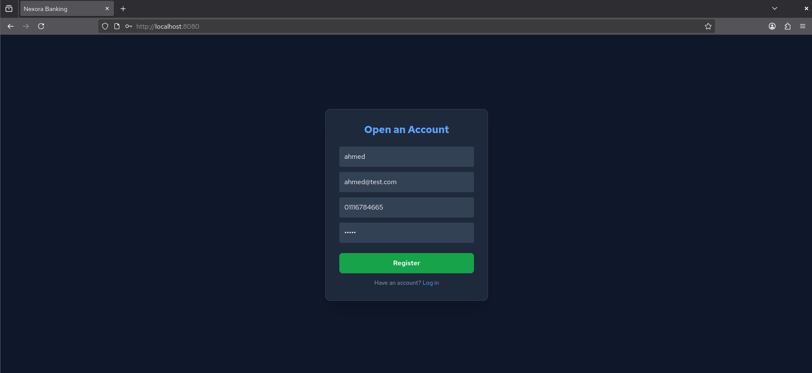
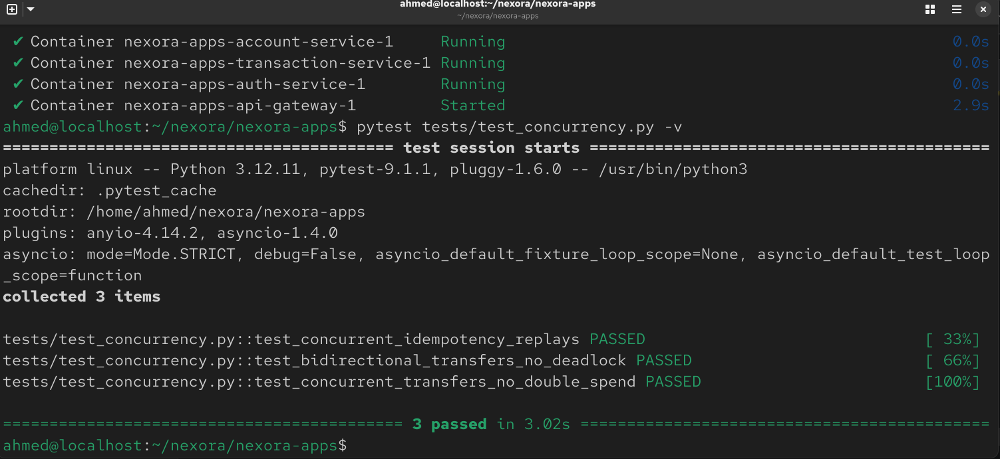
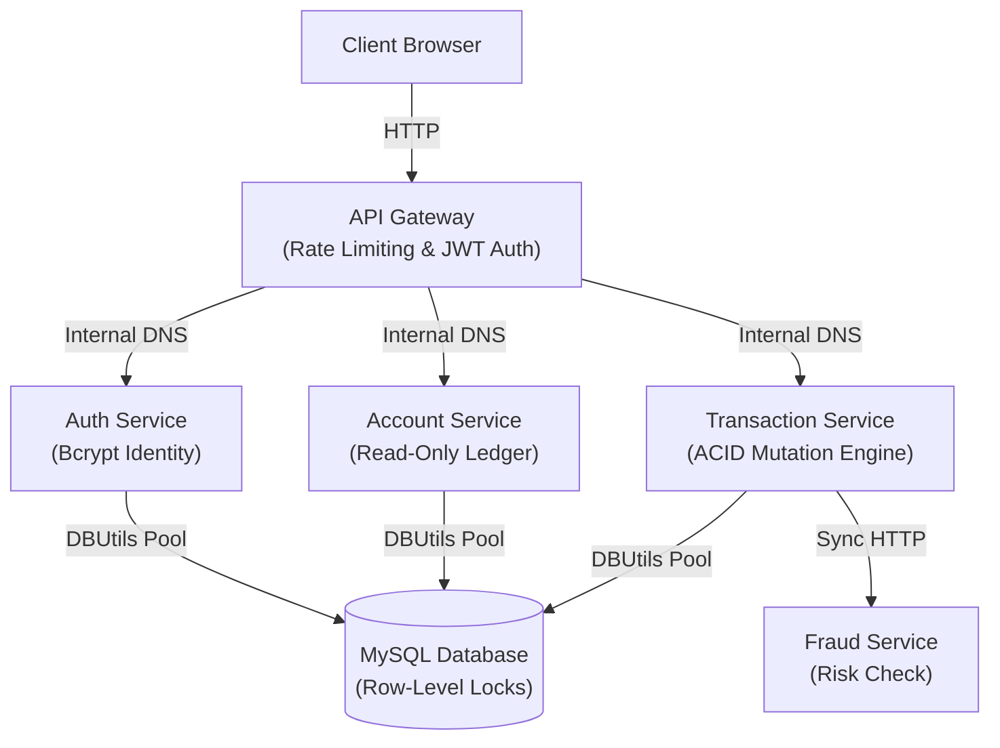
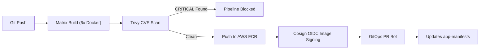
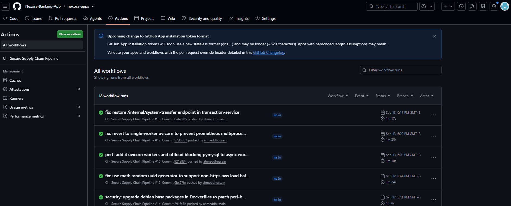
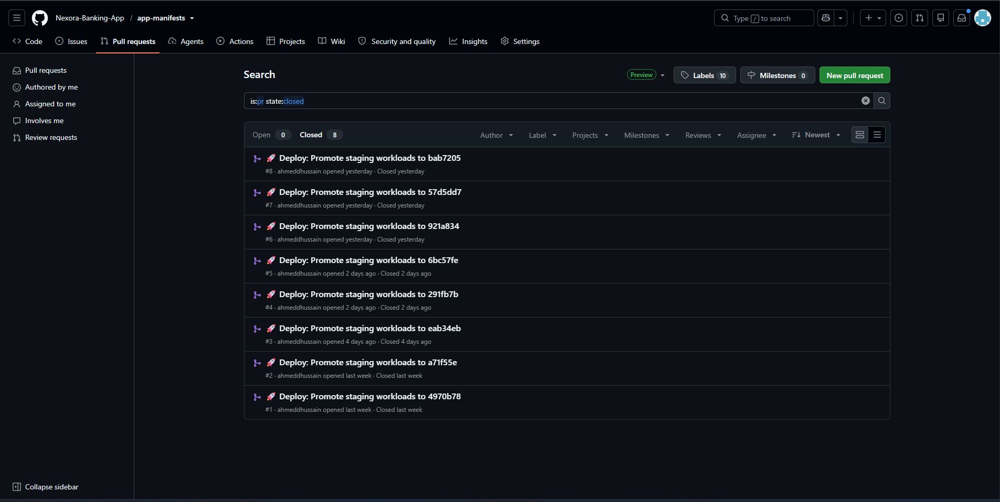
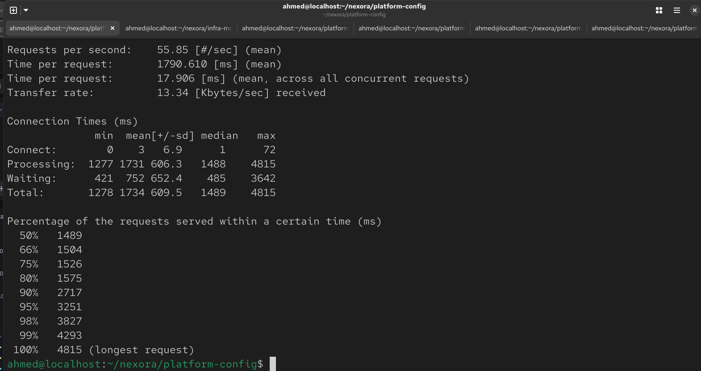

<div align="center">

#  Nexora Core Banking: Workloads & Supply Chain

### Enterprise Microservices & Secure CI/CD Pipeline

**FastAPI • PyMySQL • JWT • Docker • GitHub Actions • Trivy • Cosign • Pytest**

<br>


<br>


<br>

This repository contains the core application workloads and the **Secure Software Supply Chain** for the Nexora Enterprise GitOps Platform. It demonstrates a distributed transaction engine with defensive financial concurrency (Two-Phase Leases & Fencing Tokens), multi-stage Docker builds, and a vulnerability-gated CI pipeline integrated with AWS ECR and Sigstore Cosign.

</div>

---

## Table of Contents

1. [Platform Overview](#platform-overview)
2. [Quick Start & Local Development](#quick-start--local-development)
3. [Configuration](#configuration)
4. [Application Architecture & Traffic Flow](#application-architecture--traffic-flow)
5. [Financial Concurrency Engine](#financial-concurrency-engine)
6. [Secure Software Supply Chain (CI)](#secure-software-supply-chain-ci)
7. [System Verification & End-to-End Testing](#system-verification--end-to-end-testing)
8. [Performance Benchmarking & Capacity Planning](#performance-benchmarking--capacity-planning)
9. [Real-World Troubleshooting & Solutions](#real-world-troubleshooting--solutions)

---

## Platform Overview

The application is decomposed into six specialized services, enforcing strict domain boundaries and least-privilege access.

| Service | Technology | Responsibility | Port |
|---|---|---|---|
| `frontend-web` | NGINX / JS / Tailwind | Web UI, client-side UUID idempotency key generation | 8080 |
| `api-gateway` | Python / FastAPI | Edge router, JWT verification, rate limiting, tracing | 8000 |
| `auth-service` | Python / FastAPI | Identity management, bcrypt hashing, onboarding grants | 8000 |
| `account-service` | Python / FastAPI | Strictly read-only CQRS ledger, paginated queries | 8000 |
| `transaction-service` | Python / FastAPI | Sole mutation authority, ACID locking, idempotency | 8000 |
| `fraud-service` | Python / FastAPI | Risk-scoring engine, HPA metrics target | 8000 |

```
account-service and transaction-service are deliberately split along CQRS lines: transaction-service is the only service permitted to mutate the ledger, which keeps all concurrency-control logic (locking, fencing tokens) in one place. account-service only ever reads, so it can be scaled or cached independently of write load without risking the invariants above.
```
---


## Quick Start & Local Development

You can run the entire microservice architecture locally. Docker Compose creates an internal bridge network that mimics Kubernetes DNS routing.

```bash
git clone https://github.com/Nexora-Banking-App/nexora-apps.git
cd nexora-apps
```

**1. Spin up the local stack**
```bash
docker compose up --build
```

**2. Verify the Frontend UI**
Open your browser to: `http://localhost:8080`.
Sign up a new user, log in, and observe the pre-seeded $1,000.00 Treasury Grant in your ledger.


](screenshots/docker-compose-up.png)

**3. Run the Concurrency Test Suite**
```bash
pip install pytest pytest-asyncio httpx
pytest tests/test_concurrency.py -v
```


---

## Configuration

Each service reads its configuration from environment variables. In Kubernetes, these are injected via the External Secrets Operator (ESO) from AWS Secrets Manager; locally, `docker-compose.yml` supplies development defaults — **never commit real secret values**.

| Variable | Used By | Purpose | Local Default |
|---|---|---|---|
| `DATABASE_URL` | auth, account, transaction-service | MySQL connection string | points to the local `mysql` compose service |
| `JWT_SECRET` | api-gateway, auth-service | Signing key for issued JWTs | dev placeholder value |
| `JWT_EXPIRY_MINUTES` | auth-service | Access token lifetime | `60` |
| `INTERNAL_SERVICE_SECRET` | all backend services | Shared secret validating service-to-service calls at the mesh boundary | dev placeholder value |
| `FRAUD_SVC_URL` | transaction-service | Internal DNS address of `fraud-service` | `http://fraud-service:8000` |
| `DB_POOL_SIZE` | auth, account, transaction-service | Max connections per service in the PyMySQL/DBUtils pool | *(document the actual configured value here)* |
| `UVICORN_WORKERS` | all backend services | Worker process count per container | `1` (see [Bottleneck Investigation](#performance-benchmarking--capacity-planning) — increasing this currently breaks Prometheus metrics) |

In production/staging, `DATABASE_URL`, `JWT_SECRET`, and `INTERNAL_SERVICE_SECRET` are generated by AWS Secrets Manager and never appear in Git — see the platform-level `platform-config` repo for the ESO `SecretStore`/`ExternalSecret` definitions.

---

## Application Architecture & Traffic Flow

The internal network topology enforces strict microsegmentation. The API Gateway is the sole entry point, and the Transaction Service is the sole mutation authority.



---

## Financial Concurrency Engine

Handling money in distributed systems requires strict invariant enforcement. The `transaction-service` implements a defensive concurrency engine to prevent deadlocks, pool exhaustion, and double-spending.

### The Two-Phase Lease & Fencing Token Workflow

```mermaid
sequenceDiagram
    participant API as API Gateway
    participant TS as Transaction Service
    participant DB as MySQL (Idempotency)
    participant FS as Fraud Service
    participant DB2 as MySQL (Accounts)

    API->>TS: POST /transfer (Idempotency-Key: UUID)

    rect rgb(30, 40, 60)
        Note over TS,DB: PHASE 1: Atomic Lease
        TS->>DB: INSERT 'PROCESSING' returning lease_version
        DB-->>TS: Connection Released
    end

    rect rgb(60, 30, 30)
        Note over TS,FS: PHASE 2: Risk Gating (no DB connection held)
        TS->>FS: GET /api/scan (Timeout: 2.0s)
        FS-->>TS: 200 OK (Threat: Low)
    end

    rect rgb(30, 60, 30)
        Note over TS,DB2: PHASE 3: Deterministic Mutation
        TS->>DB2: BEGIN TRANSACTION
        TS->>DB2: SELECT ... FOR UPDATE (Ordered by min_id -> max_id)
        TS->>DB2: UPDATE Balances
        TS->>DB2: UPDATE Idempotency WHERE lease_version = X
        DB2-->>TS: COMMIT & Connection Released
    end

    TS-->>API: 200 OK (Success)
```



---

## Secure Software Supply Chain (CI)

This repository enforces a strict DevSecOps pipeline (`.github/workflows/ci.yml`). Code is never manually built or deployed.



### Pipeline Responsibilities
* **Vulnerability Gating:** Fails the build immediately if `CRITICAL` OS or library vulnerabilities are detected.
* **Keyless Cryptographic Signing:** Signs container images using GitHub Actions OIDC federation via Cosign.
* **Automated GitOps Promotion:** Uses a scoped token to open a Pull Request in `app-manifests`, pinning workloads to immutable Git SHA image digests.




---

## System Verification & End-to-End Testing

### Automated Concurrency Test Suite
The repository includes an asynchronous integration test suite (`tests/test_concurrency.py`) that executes parallel requests against the cluster to empirically validate concurrency guarantees.

```text
tests/test_concurrency.py::test_concurrent_transfers_no_double_spend PASSED   [ 33%]
tests/test_concurrency.py::test_concurrent_idempotency_replays PASSED         [ 66%]
tests/test_concurrency.py::test_bidirectional_transfers_no_deadlock PASSED   [100%]
```


* **Test 1:** Fires 10 simultaneous transfers from a single account. Asserts that row-level locking strictly serializes execution, resulting in exact mathematical deductions and rejections.
* **Test 2:** Fires 10 simultaneous transfers using the exact same `Idempotency-Key`. Asserts that the atomic lease ensures the transfer executes exactly once.
* **Test 3:** Fires simultaneous cross-transfers (User A → User B and User B → User A). Asserts that deterministic ascending lock ordering eliminates SQL deadlocks.

---

## Performance Benchmarking & Capacity Planning

Performance profiling was conducted in the **Staging Environment** using an automated `httpx`/`asyncio` load generator, across two concurrency profiles.

**1. Single-Account Hotspot (Row-Lock Contention)**
* **Scenario:** 10 concurrent workers executing transfers against the *exact same* sender/receiver account pair.
* **Results:** Throughput **18.15 req/sec**, p50 latency **420ms**, p99 latency **3,660ms**.
* **Analysis:** Consistent with InnoDB row-lock serialization — concurrent transactions queue behind `SELECT ... FOR UPDATE` to preserve ACID invariants, so tail latency growing with queue depth here is expected and correct behavior.

**2. Isolated Workload (Zero Row Overlap)**
* **Scenario:** 100 concurrent requests distributed across 100 fully independent account pairs.
* **Results:** Throughput capped at **13.22 req/sec**, p50 latency **2.6s**, p99 latency **7.5s** (100% success rate).
* **Analysis:** Removing row contention did not reduce latency the way a pure lock-contention model would predict, which rules out row locking as the dominant factor for this profile. CPU utilization across all services stayed under 1% in a post-test snapshot (not yet confirmed via live sampling during the run itself).

**Bottleneck Investigation — In Progress**

Two changes were attempted to address single-worker serialization in `transaction-service`:
* **Thread-offloaded DB I/O** (`asyncio.to_thread()` wrapping blocking PyMySQL calls) — deployed and live.
* **Increased Uvicorn worker count** (`--workers 4`) — attempted, but reverted. It caused `api-gateway` pods to enter `CrashLoopBackOff` from a Prometheus metrics-registry collision across worker processes (see [Troubleshooting #3](#3-prometheus-multiprocess-collision-in-uvicorn)). Horizontal scaling currently relies on Kubernetes replica count (`replicas: 2`) rather than in-container worker concurrency.

Because the worker-count change was never actually live, the isolated-workload benchmark above reflects the thread-offload fix alone, running with `UVICORN_WORKERS=1`. Re-benchmarking after the worker-concurrency issue is resolved is the next step before any capacity-planning numbers can be trusted.

**Known fix for the reverted change:** run `prometheus-fastapi-instrumentator` in multiprocess mode — set `PROMETHEUS_MULTIPROC_DIR` and use `prometheus_client.multiprocess.MultiProcessCollector` so each worker writes to a shared file-backed registry instead of colliding in memory. Not yet implemented; tracked as an open item.

**Production capacity planning is deferred** until a real per-request compute cost is measured via live CPU sampling during a load run (not a post-test snapshot). No sizing numbers are published here yet, to avoid stating a conclusion the current data doesn't support.

**Reproducing these benchmarks:**
```bash
# Confirm pod/replica state before running, since it affects results directly:
kubectl get pods -n nexora -o wide
kubectl get deploy -n nexora -o jsonpath='{range .items[*]}{.metadata.name}{"  replicas: "}{.spec.replicas}{"\n"}{end}'

# Hotspot profile (single account pair, 10 concurrent):
python3 tests/load_benchmark.py

# Isolated profile (100 independent pairs, zero row overlap):
python3 tests/load_benchmark_isolated.py

# To correlate with compute usage, watch this live in a second terminal
# WHILE the benchmark runs (a post-test snapshot is not sufficient):
watch -n1 kubectl top pods -n nexora
```

](screenshots/isolated-test.png)

---

## Real-World Troubleshooting & Solutions

This section documents actual technical bugs encountered during the application engineering process, root-cause diagnoses, and the fixes applied.

### 1. Supply Chain Blocked by Sub-Dependency CVEs
* **Symptom:** Trivy blocked the CI pipeline due to `CRITICAL` CVEs in `PyMySQL` (CVE-2024-36039) and `h11` (CVE-2025-43859).
* **Diagnosis:** While `PyMySQL` was an explicit dependency, `h11` was a sub-dependency of `httpx`. Forcing `pip install --upgrade h11` caused a dependency resolution crash with `httpcore`.
* **Fix:** Upgraded the root parent library (`httpx==0.27.0`), which natively resolved and installed the patched version of `h11` cleanly.

### 2. Browser Blocking `crypto.randomUUID()` on AWS Load Balancer
* **Symptom:** Clicking "Send Funds" on the frontend failed silently. Console logged `TypeError: crypto.randomUUID is not a function`.
* **Diagnosis:** Modern browsers disable the `crypto` module outside a Secure Context. Because the AWS Load Balancer served raw HTTP for the demo, the browser disabled the UUID generator.
* **Fix:** Replaced the call with an RFC4122-compliant, Math-based UUID generator in `frontend-web/index.html` to support non-HTTPS testing.

### 3. Prometheus Multiprocess Collision in Uvicorn
* **Symptom:** `api-gateway` pods entered `CrashLoopBackOff` when scaled to 4 workers.
* **Diagnosis:** `prometheus-fastapi-instrumentator` stores its metric registry in single-process memory. Running `uvicorn --workers 4` caused child processes to collide when attempting to bind the same `/metrics` registry.
* **Fix (interim):** Reverted to `--workers 1` per container, offloaded database I/O to background threads (`asyncio.to_thread`), and relied on Kubernetes replica count (`replicas: 2`) for horizontal scaling instead. A proper multiprocess-mode fix (`PROMETHEUS_MULTIPROC_DIR`) is scoped but not yet implemented — see [Performance Benchmarking](#performance-benchmarking--capacity-planning).

### 4. Ambiguous Network Timeout vs. Destructive Compensation Hazard
* **Symptom:** Onboarding grants that timed out over the network triggered local user deletion in `auth-service`, causing foreign-key crashes and unallocated treasury debits.
* **Diagnosis:** Network timeouts are ambiguous states; deleting local state on timeout violates distributed-systems safety.
* **Fix:** Switched onboarding keys to deterministic values (`grant-user-{id}`) instead of random UUIDs and eliminated local deletes, making grant RPCs safely retryable via the idempotency engine.

---

